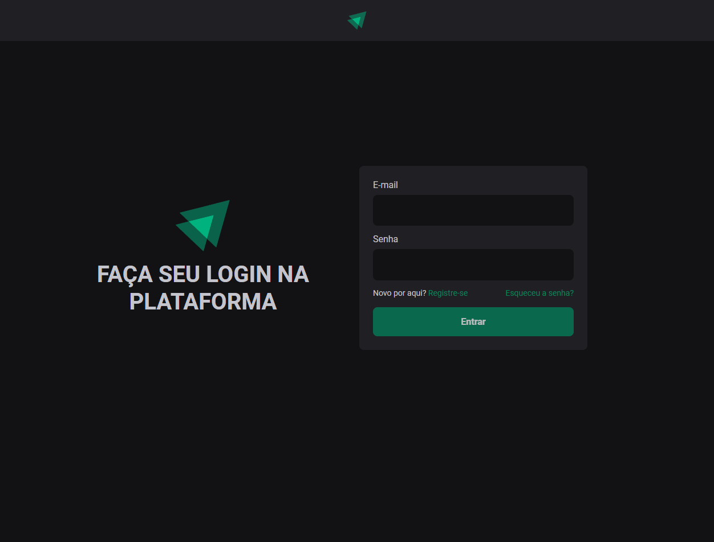
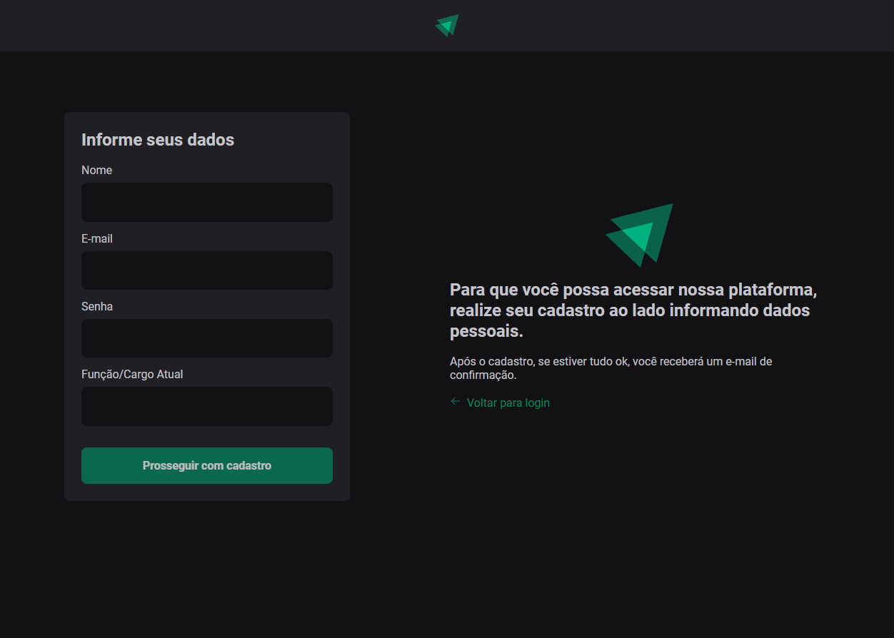
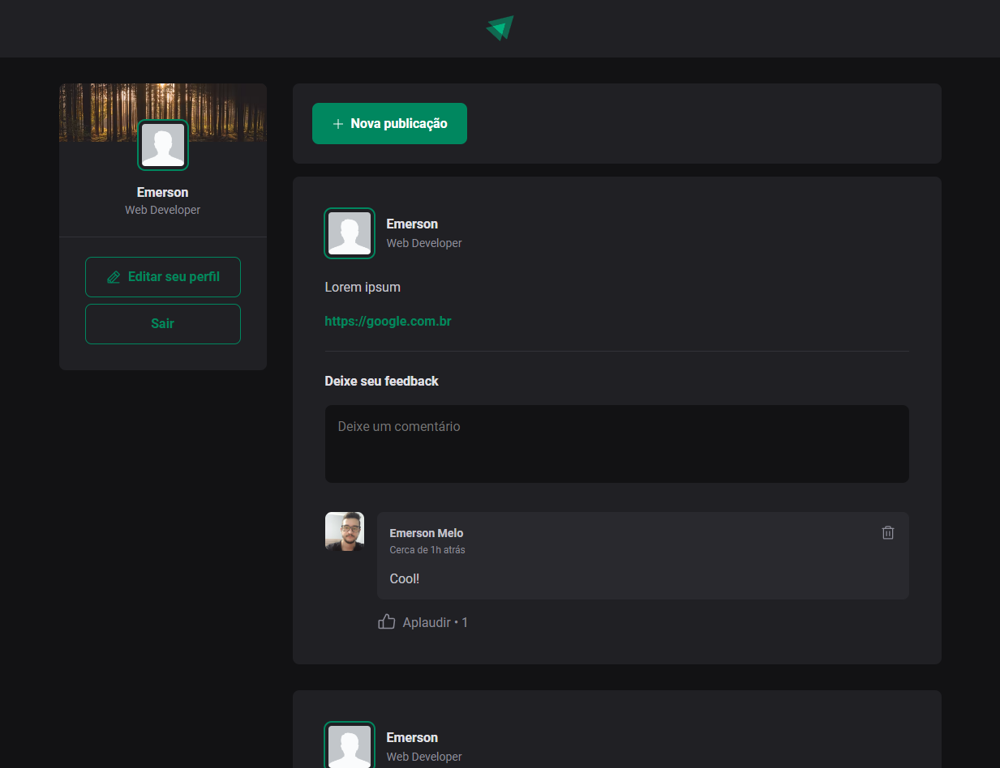
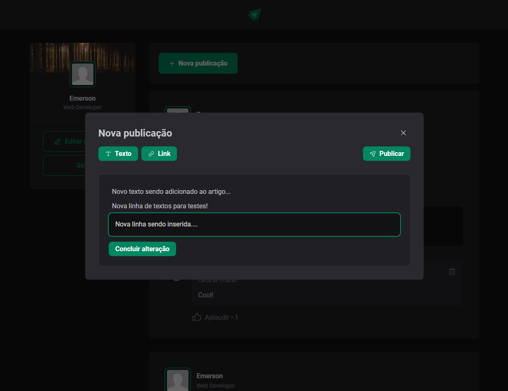

    
<h1 align="center">Ignite Feed</h1>

## Projeto

Este projeto ainda está em desenvolvimento...

Uma aplicação simulando uma rede social de artigos, inicialmente foi um exercício durante o curso React da Rocketseat, porém, fui incrementando a aplicação como um backend completo desenvolvido do zero e telas para login, cadastro, modal para publicação de novas postagens, etc.

Cada um dos projetos está separado por pastas

A pasta <b>server</b> contém o Backend desenvolvido com NodeJS + Express + SQLite + Typescript
A pasta <b>web</b> contém Frontend desenvolvido com ReactJS + Vite + Typescript

## Preview

  
  

  
  

## Demonstração
O backend foi publicado no [Heroku](https://www.heroku.com/) e o frontend publicado no [Netlify](https://www.netlify.com/).

As imagens salvas estão sendo armazenadas no [Cloudinary](https://cloudinary.com/)

Acesse o frontend: https://astounding-youtiao-95990a.netlify.app/

Acesse o backend: https://ignite-feed-note.herokuapp.com/

## Layout

Você pode visualizar o layout do projeto através do link abaixo:

- [Layout Web](<https://www.figma.com/file/wNYog543mcvSLQ6c0hI8Rl/Ignite-Feed-(Community)?node-id=0%3A1>)

## Tecnologias

Tecnologias utilizadas no projeto:
Frontend:
- [React](https://reactjs.org)
- [Vite](https://vitejs.dev/)
- [TypeScript](https://www.typescriptlang.org/)
- [Phosphor Icons](https://phosphoricons.com/)
- [React Modal](https://www.npmjs.com/package/react-modal#api-documentation)

Backend:
...

## Como utilizar

Em construção...
