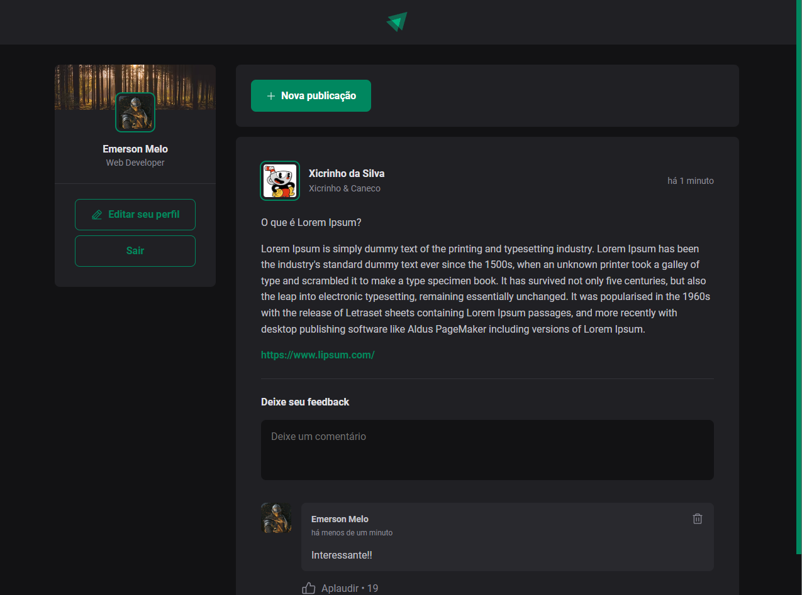

<div align="center">
    
<h1 align="center">Ignite Feed</h1>
</div>

## Projeto

Uma aplicação simulando uma rede social de artigos, inicialmente foi um exercício durante o curso React da Rocketseat, porém, fui incrementando a aplicação como um backend completo desenvolvido do zero e telas para login, cadastro, modal para publicação de novas postagens, etc.

Cada um dos projetos está separado por pastas

A pasta <b>server</b> contém o Backend desenvolvido com NodeJS + Express + SQLite + Typescript
A pasta <b>web</b> contém Frontend desenvolvido com ReactJS + Vite + Typescript

## Preview

<p align="left">
  
  
</p>
<p align="left">
  
  
</p>
<p align="left">
  
</p>

## Demonstração
O backend foi publicado no [Heroku](https://www.heroku.com/) e o frontend publicado no [Netlify](https://www.netlify.com/).

As imagens salvas estão sendo armazenadas no [Cloudinary](https://cloudinary.com/)

Acesse o frontend: https://astounding-youtiao-95990a.netlify.app/

Acesse o backend: https://ignite-feed-note.herokuapp.com/


## Layout

Você pode visualizar o layout do projeto através do link abaixo:

- [Layout Web](<https://www.figma.com/file/wNYog543mcvSLQ6c0hI8Rl/Ignite-Feed-(Community)?node-id=0%3A1>)

## Tecnologias

Tecnologias utilizadas no projeto:
Frontend:
- [React](https://reactjs.org)
- [Vite](https://vitejs.dev/)
- [TypeScript](https://www.typescriptlang.org/)
- [Phosphor Icons](https://phosphoricons.com/)
- [React Modal](https://www.npmjs.com/package/react-modal#api-documentation)
- [React Toastify](https://fkhadra.github.io/react-toastify/introduction)
- [Netlify](https://www.netlify.com/)

Backend:
- [Node](https://nodejs.org/en/)
- [Express](https://expressjs.com/pt-br/)
- [TypeScript](https://www.typescriptlang.org/)
- [SQLite](https://www.sqlite.org/index.html)
- [TypeORM](https://typeorm.io/)
- [Swagger](https://swagger.io/)
- [Heroku](https://www.heroku.com/)
- [Cloudinary](https://cloudinary.com/)

## Documentação
Todas as apis estão listadas no swagger, podendo também serem testadas.
<p align="left">
  
</p>

## Como utilizar
Essa aplicação utiliza [Nodejs](https://nodejs.org/en/) para a execução do mesmo.

Baixe o repositório clicando no botão "Clone" e depois "Download ZIP".

Você também pode utilizar o [Git](https://git-scm.com/) para clonar o repositório

```bash
git clone https://github.com/emersonmelomartins/ignite-feed-react-node.git
```
A instalação das dependências deve ser efetuada em cada um dos projetos (server e web).
### Instalação via node ou yarn
```bash
# yarn
yarn
# node
npm install
```

### Carregando tabelas banco de dados
```bash
# yarn
yarn migration:run
# node
npm run migration:run
```

### Execução do projeto
```bash
# yarn
yarn dev
# node
npm run dev
```

O comando acima irá iniciar o servidor, necessário inicializar o "server" primeiro para que o "web" tenha acesso.
